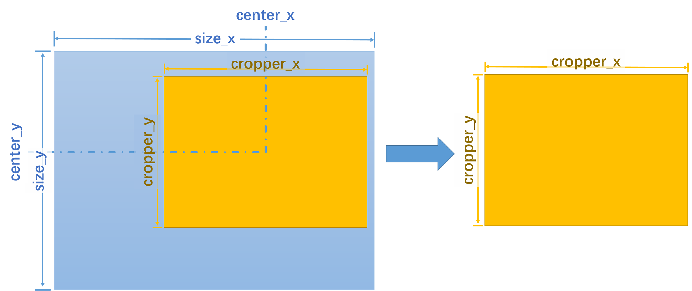
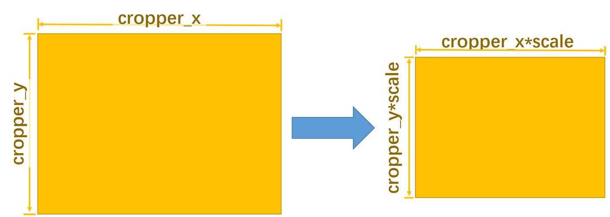
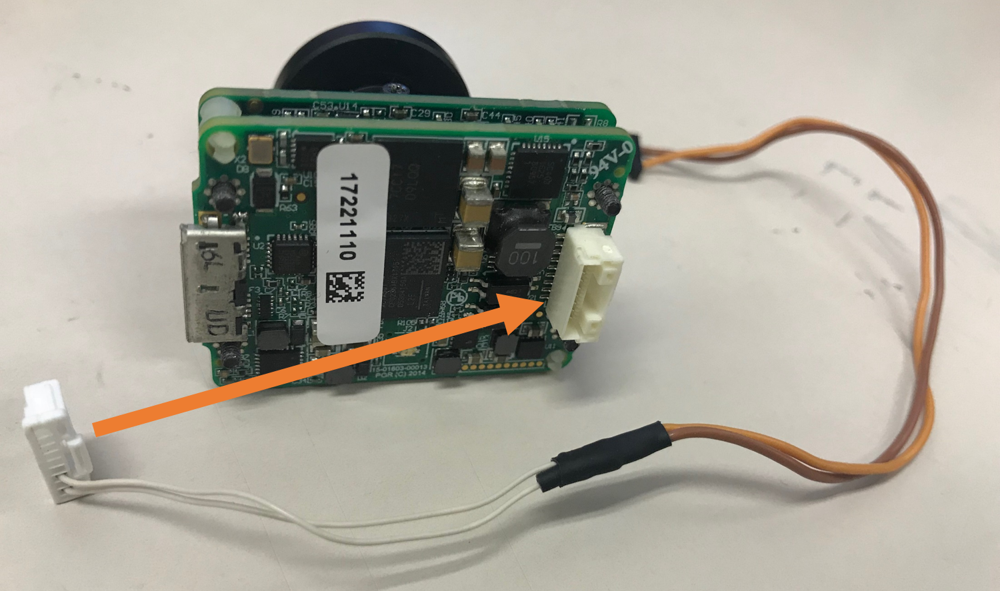
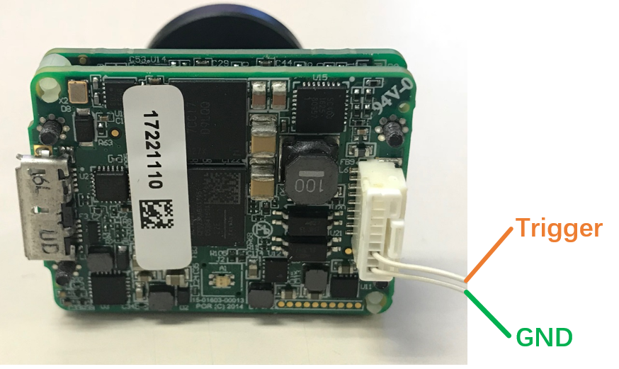

# PointGrey Reader
## Download code  

Enter the catkin work space  
```
cd YOUR_ROS_WORKSPACE/src  
git clone https://github.com/gaowenliang/ptgrey_reader.git
```

## Install dependency for ptgrey

### Install libusb-1.0.21  
```
cd YOUR_ROS_WORKSPACE/src/ptgrey_reader/install/usb/  
tar jxvf libusb-1.0.21.tar.bz2  
cd libusb-1.0.21/  
```  
Follow the INSTALL file to make and install the libusb library:  
```
./configure  
make   
sudo make install  
```
### Install camera driver for ptgrey  
The driver supports the computer with Intel CPUs and NVIDIA TX2.

* For computer with Intel CPU:
```
cd YOUR_ROS_WORKSPACE/src/ptgrey_reader/install/amd64/
tar zxvf flycapture2-2.11.3.121-amd64-pkg.tgz
cd flycapture2-2.11.3.121-amd64/
```

* For TX2:
```
cd YOUR_ROS_WORKSPACE/src/ptgrey_reader/install/arm64/
tar zxvf flycapture.2.11.3.121_arm64.tar.gz
cd flycapture.2.11.3.121_arm64/
cd include/
sudo mkdir /usr/include/flycapture
sudo cp *.h /usr/include/flycapture
cd ../lib/
sudo cp lib* /usr/lib
```

Follow the README file. Install requirements:  
```
sudo apt-get install libraw1394-11 libgtkmm-2.4-dev libglademm-2.4-dev libgtkglextmm-x11-1.2-dev libusb-1.0-0 -y
```  
Install Flycapture2 driver library:
```
sudo sh install_flycapture.sh
```
Build the package:
```
cd YOUR_ROS_WORKSPACE/   
catkin_make
```
Before using that you may need to give them enough authority  
```
sudo gedit /etc/udev/rules.d/40-flir.rules
```  
Change all the 0613 or 0664 to 777 in the "40-flir.rules" and save.
Then restart the system.

## Run
Use rosrun the camera_list to see your camera ID number.  
```
roscore
rosrun ptgrey_reader camera_list
```
The camera infomation will be shown in screen, such as:

```
FlyCapture2 library version: 2.11.3.425
Application build date: Jun  7 2018 23:22:29

Number of cameras detected: 1

========== CAMERA INFORMATION ============
         Serial number | 17221110
          Camera model | Chameleon3 CM3-U3-13Y3M
         Camera vendor | Point Grey Research
                Sensor | OnSemi PYTHON1300 (1/2" Mono CMOS)
            Resolution | 1280x1024
      Firmware version | 1.13.3.0
   Firmware build time | Tue Nov 15 18:35:47 2016

Done! Press Enter to exit...
```

Copy the `Serial number` to launch file as `device`, and launch.
```
roslaunch ptgrey_reader single.launch 
```
After launch the camera, there will be a ROS topic named `/pg_YOU_SERIAL_NUM/image_raw`, such as `/pg_17221069/image_raw`. The type is [`sensor_msgs/Image`](http://docs.ros.org/kinetic/api/sensor_msgs/html/msg/Image.html).

Parameter | Detail | Default
 :---: | --- | :---: 
`device` | Device Serial number |  
`is_pub`   | Publish ROS image message or not | `true`
`is_show`  | Show the image in screen or not  | `false`
`is_print` | Print the infomation on screen or not | `true` 
`is_sync`  | Use hardware trigger or not | `false`
`is_grey`  | (for Color Sensor) Output Grey Scale image or not | `false`
`is_roi`   | Use ROI and down sample not |  `false` 
`is_auto_shutter` | Auto shutter time or not  |  `false` 
`shutter`    | Shutter time |  `0.0001` to `49.9313` 
`brightness` | Brightness |  `5.0` 
`exposure`   | Exposure |  `0.8` 
`WB_red`     | Write Balance red |  `550` 
`WB_Blue`    | Write Balance blue |  `810` 
`gain`       | Gain |  `0.0 to 18.0` 

If `is_grey` is `true`, there will be a extra ROS tpoic named `/pg_YOU_SERIAL_NUM/image_grey`.

If `is_roi` is `true`, there will be a extra ROS tpoic named `/pg_YOU_SERIAL_NUM/image`.
The ROI and down sample with such two step rule:
* step1: crop ROI image



* step2: down sample, with `down_sample_scale` <= 1.0



## Hardware Trigger
The Hardware trigger is to capture an image while the camera received a trigger signal. An extra trigger cable is required.

Buy the elements of the trigger cable in [JST NSHR-09V-S](https://www.digikey.hk/product-detail/zh/jst-sales-america-inc/NSHR-09V-S/455-2785-ND/3313624) and [JST ASSHLSSHL28W51](https://www.digikey.hk/product-detail/zh/jst-sales-america-inc/ASSHLSSHL28W51/455-3194-ND/6194849).

Set `is_sync` as true in the launch file. And make sure the `rate` is larger than the trigger signal frequency.

The Trigger signal is a high level signal.

## Issue  
### USB buffer issue:
If progrem cannot run successfully, especially for muti-camera system and high FPS system, change the USB buffer before roslaunch the progrem:
* To temporarily set the maximum usbfs memory limit, run this command:
```
sudo -S sh -c 'echo 2048 > /sys/module/usbcore/parameters/usbfs_memory_mb'
```
* To permanently set the maximum usbfs memory limit:
Open the /etc/default/grub file in any text editor.
```
sudo gedit /etc/default/grub
```
Find and replace:
`GRUB_CMDLINE_LINUX_DEFAULT="quiet splash"`
with this:
`GRUB_CMDLINE_LINUX_DEFAULT="quiet splash usbcore.usbfs_memory_mb=2048"`
Update grub with these settings:
```
sudo update-grub
```
Reboot and test a USB 3.1 camera.

Ps: 2048Mb is not required. Any buffer size is OK.

